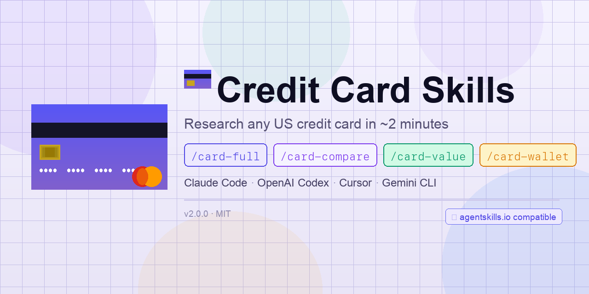

# Credit Card Skills



**Credit Card Skills turns your AI coding agent into a credit card research analyst you can query on demand.**

Nine specialized research skills for [Claude Code](https://docs.anthropic.com/en/docs/claude-code), [OpenAI Codex](https://developers.openai.com/codex), and [ClawHub](https://clawhub.com). Full card reports, earning rates, transfer partners, credits, news, comparisons, value estimates, wallet audits, and portfolio recommendations with churning strategy — all as slash commands that return in ~2 minutes.

[](https://agentskills.io)
[](https://code.claude.com)
[](https://developers.openai.com/codex)
[](https://skills.sh)
[](LICENSE)
[](.claude-plugin/plugin.json)

### Without Credit Card Skills

- You ask about a card and get a generic summary based on stale training data
- Earning rates are wrong or missing caps and exclusions
- Transfer partners are outdated — ratios changed months ago
- Credits are mixed up with earning multipliers
- You have no idea what changed last month
- Comparing two cards means opening six browser tabs yourself

### With Credit Card Skills

| Skill | What it does |
|-------|--------------|
| `/card-full` | Complete card report — fees, offer, earnings, credits, benefits, protections, eligibility, strategy |
| `/card-rate` | Earning rates by category with caps, exclusions, and merchant-coding caveats |
| `/card-transfer` | Transfer partners with ratios, timing, and restrictions |
| `/card-credits` | Statement credits with amount, cadence, trigger rules, and enrollment requirements |
| `/card-news` | Material changes from the last 3 months |
| `/card-compare` | Side-by-side comparison of two cards across every dimension |
| `/card-value` | First-year value estimate: welcome bonus + earn + credits - annual fee |
| `/card-wallet` | Wallet audit: earning map, credit stack, overlaps, gaps, and optimization |
| `/card-profile-recommend` | Portfolio grading (MVP / Keep / Drop), 2–3 new card recommendations with churning strategy, issuer rules, and signup bonus sequencing |

## Demo: one card, five angles

You don't have to remember which command does what. Start with `/card-full` for the complete picture, then drill into specifics.

```
You:   /card-full Chase Sapphire Preferred

Claude: [searches issuer page + 5 secondary sources, ~90 seconds]

        ## Fees
        Annual fee: $95 | Foreign transaction: None

        ## Welcome Offer
        75,000 Ultimate Rewards after $4,000 in 3 months ($1,500 value at 2 cpp)

        ## Earning Rates
        5x on Chase Travel portal | 3x dining, streaming, online groceries
        2x general travel | 1x everything else

        ## Credits
        $50 annual Chase Travel hotel credit (auto-applied)

        ## Transfer Partners
        13 partners — Hyatt (1:1), United (1:1), Southwest (1:1)...

        ...protections, eligibility, strategy

You:   /card-rate Chase Sapphire Preferred

Claude: [fetches issuer page + 1 secondary, ~30 seconds]

        All earning categories with caps, exclusions, merchant-coding
        notes, and activation requirements. The details /card-full
        summarized — now fully expanded.

You:   /card-compare Chase Sapphire Preferred vs Amex Gold

Claude: [searches both cards in parallel, ~90 seconds]

        Side-by-side tables: fees, earning rates, credits, transfer
        partners, benefits. Winner declared per dimension. Bottom line
        recommendation based on spending profile.

You:   /card-value Chase Sapphire Preferred $500/mo dining, $200/mo travel

Claude: First-year value: +$1,847
        Welcome bonus: $1,500 | Earn value: $442 | Credits: $50 | Fee: -$95

You:   /card-wallet Chase Sapphire Preferred, Amex Gold, Citi Double Cash

Claude: Your 3-card wallet covers dining (4x), groceries (4x), travel
        (5x), and everything else (2x). No category gaps.
        Overlap: dining is double-covered — CSP 3x vs Gold 4x.
        Recommendation: drop CSP or downgrade to Freedom Flex.
```

## Who this is for

You're a credit card optimizer, a points enthusiast, or someone deciding which card to get next. You want real data — not a ChatGPT summary that confuses the Sapphire Preferred with the Sapphire Reserve or tells you about a welcome bonus that expired six months ago.

This is not a chatbot. It is a research pipeline that hits live sources, cross-references data, and flags when something is unconfirmed.

---

## Install

**Requirements:** [Claude Code](https://docs.anthropic.com/en/docs/claude-code), [Git](https://git-scm.com/). Works with any agent that supports the [Agent Skills](https://agentskills.io) standard.

**Quickest — via [skills.sh](https://skills.sh):**

```bash
npx skills add jiahongc/credit-card-skills
```

**Or run the install script** from your project root — auto-detects your agent:

```bash
bash <(curl -fsSL https://raw.githubusercontent.com/jiahongc/credit-card-skills/main/install.sh)
```

<details>
<summary>Target a specific agent</summary>

```bash
# Claude Code only  → .claude/skills/
bash <(curl -fsSL https://raw.githubusercontent.com/jiahongc/credit-card-skills/main/install.sh) --claude

# OpenAI Codex only → .agents/skills/
bash <(curl -fsSL https://raw.githubusercontent.com/jiahongc/credit-card-skills/main/install.sh) --codex

# Both
bash <(curl -fsSL https://raw.githubusercontent.com/jiahongc/credit-card-skills/main/install.sh) --all
```

</details>

<details>
<summary>Claude Code plugin (no install needed)</summary>

```bash
claude --plugin-dir /path/to/credit-card-skills
```

Skills load with a namespace: `/credit-card-skills:card-full`, etc.

</details>

---

## Setup (Optional)

For faster search results, set a [Brave Search API](https://brave.com/search/api/) key:

```bash
cp .env.example .env
# Edit .env and add your BRAVE_API_KEY
```

Free tier gives 2,000 queries/month. Without it, commands fall back to built-in web search (slower).

---

## `/card-full`

This is the **complete picture**.

When you don't know which specific detail you need, start here. `/card-full` returns every important dimension of a card in one shot: fees, welcome offer, earning rates, redemption options, statement credits, travel benefits, purchase protections, card mechanics, eligibility requirements, and strategic positioning.

It is search-required — it hits the issuer's official product page first, then pulls up to 5 secondary sources (NerdWallet, The Points Guy, Doctor of Credit, Bankrate, One Mile at a Time) for current offer details and cross-referencing. Takes about 90 seconds.

### Example

```
You:   /card-full Amex Platinum

Claude: ## Fees
        Annual fee: $695 | Foreign transaction: None

        ## Welcome Offer
        150,000 MR after $8,000 in 6 months

        ## Earning Rates
        5x flights booked directly or via Amex Travel | 5x prepaid hotels
        via Amex Travel | 1x everything else

        ## Credits
        $200 airline fee credit (annual, one airline) | $200 hotel credit
        (semi-annual, FHR/THC) | $200 Uber credit ($15/mo + $20 Dec) |
        $155 Walmart+ | $100 Saks ($50 semi-annual) | $300 Equinox |
        $240 digital entertainment | $199 CLEAR Plus
        Total: ~$1,594/yr if fully utilized

        ## Transfer Partners
        20 airline + hotel partners — ANA (1:1), Singapore (1:1),
        Hilton (1:2), Marriott (1:1.2)...

        ## Travel Benefits
        Centurion Lounge access | Priority Pass Select | $200 FHR credit |
        Global Entry/TSA PreCheck credit ($100 every 4 years)

        ...protections, eligibility, strategy
```

This is not a summary from training data. It is a live research report with sourced data and confidence flags on anything that could not be verified.

---

## `/card-rate`

This is the **earning structure deep dive**.

When you already know the card and want the full earning picture — every category, every cap, every exclusion, every merchant-coding caveat. `/card-rate` goes deeper than `/card-full` on the earn side: activation requirements, spending thresholds, quarterly rotation details, and the specific merchant category codes that determine what counts as "dining" or "travel."

It is knowledge-first — starts from training knowledge and verifies against the issuer page plus one secondary source. Returns in about 30 seconds.

### Example

```
You:   /card-rate Citi Double Cash

Claude: ## Rate Summary
        Base rate: 2% cash back on all purchases (1% at purchase + 1% at payment)
        Point currency: Citi ThankYou Points (1 point = 1 cent standard)

        ## Earning Categories
        1. All purchases — 2% cash back (1% at purchase + 1% at payment)
        2. Hotels, car rentals, attractions via Citi Travel portal — 5% total
        3. Balance transfers, cash advances — 0%

        ## Caps And Exclusions
        - No annual or monthly cap on the base 2% rate
        - Second 1% requires paying at least the minimum due on time
        - 5% travel rate applies only to the Citi Travel portal
```

The detail that matters: "1% when you buy + 1% as you pay" is a mechanical distinction that most summaries gloss over. If you miss a minimum payment, you lose half the earn rate. `/card-rate` surfaces these gotchas.

---

## `/card-transfer`

This is the **redemption pipeline**.

Transfer partners are the reason premium cards are worth premium fees. But partner lists change, ratios shift, and transfer bonuses come and go. `/card-transfer` returns every transfer partner, the current ratio, typical transfer timing, minimum transfer amounts, and any restrictions or temporary bonuses.

Knowledge-first, verified against the issuer page and one secondary source.

### Example

```
You:   /card-transfer Chase Sapphire Preferred

Claude: ## Transfer Program
        Currency: Chase Ultimate Rewards
        Number of partners: 13 (8 airline, 5 hotel)

        ## Airline Partners
        1. United MileagePlus — 1:1 | instant
        2. Southwest Rapid Rewards — 1:1 | instant
        3. British Airways Avios — 1:1 | instant
        4. Air France/KLM Flying Blue — 1:1 | 1-2 days
        5. Singapore KrisFlyer — 1:1 | 1-2 days
        ...

        ## Hotel Partners
        1. World of Hyatt — 1:1 | instant
        2. IHG One Rewards — 1:1 | 1-2 days
        3. Marriott Bonvoy — 1:1.5 (1,000 UR → 1,500 Marriott) | 1-2 days
        ...

        ## Restrictions
        - Points must be earned on a Sapphire, Freedom, or Ink card
        - Combined with other UR-earning cards to transfer
```

The Hyatt 1:1 transfer alone makes the Sapphire ecosystem one of the highest-value programs in the US. `/card-transfer` makes these redemption paths visible so you can plan accordingly.

---

## `/card-credits`

This is the **credits inventory**.

Credits are the reason a $695 annual fee card can have a net cost under $100 — but only if you actually use them. `/card-credits` lists every statement credit and cash-like credit on the card: the dollar amount, how often it renews, what triggers it, whether you need to enroll, and the practical restrictions that determine whether you'll actually get value from it.

Important distinction: `/card-credits` only includes statement credits and direct cost offsets. Enhanced earning rates (like "5x on Lyft") are earning multipliers, not credits — those belong in `/card-rate`.

### Example

```
You:   /card-credits Amex Gold

Claude: ## Credits Overview
        Total potential credits: $424/yr

        ## Credit Details
        1. Uber Cash — $120/yr ($10/mo)
           Trigger: auto-loaded to Uber account
           Enrollment: link Amex to Uber account
           Restriction: monthly, use-it-or-lose-it, Uber/Uber Eats only

        2. Dining credit — $120/yr ($10/mo)
           Trigger: purchase at Grubhub, The Cheesecake Factory,
           Goldbelly, Wine.com, Milk Bar, or select Resy restaurants
           Enrollment: enroll each merchant in Amex Offers
           Restriction: monthly, participating merchants only

        3. Dunkin' credit — $84/yr ($7/mo)
           Trigger: purchase at Dunkin'
           Enrollment: add Amex to Dunkin' app
           Restriction: monthly, Dunkin' only

        4. Resy dining credit — $100/yr
           Trigger: statement credit on purchases at Resy restaurants
           Restriction: annual, Resy bookings only
```

The enrollment requirements are the part people miss. The Amex Gold dining credit requires enrolling each merchant individually through Amex Offers — if you don't enroll, you don't get the credit even if you spend at the right place.

---

## `/card-news`

This is the **change tracker**.

Credit cards change constantly — welcome bonuses increase and expire, lounge access gets nerfed, new credits appear, transfer partners come and go. `/card-news` returns material changes from the last 3 months so you know exactly what shifted since you last looked.

Search-required — hits the issuer newsroom plus up to 5 secondary sources with a 3-month freshness filter. Only returns changes that materially affect cardholder value.

### Example

```
You:   /card-news Capital One Venture X

Claude: ## News Window
        2025-12-12 to 2026-03-12 (90 days)

        ## Recent Updates
        1. Elevated 100K welcome bonus expired (Jan 5, 2026) — reverted
           to 75K after $4K spend
        2. Lounge guest access removed (Feb 1, 2026) — guests now $45
           each; free only after $75K/yr spend
        3. Authorized user lounge access now paid (Feb 1, 2026) —
           $125/yr per AU
        4. Priority Pass guest privileges revoked (Feb 1, 2026) —
           guests now $35 each
        5. Discover network migration begins for other Capital One
           cards — Venture X stays on Visa

        ## Summary
        February 2026 brought significant lounge access downgrades.
        Core earning, annual fee, and travel credits remain unchanged.
```

This is the command that saves you from recommending a card based on benefits that no longer exist. The Venture X lounge downgrade in February 2026 fundamentally changed the card's value proposition — `/card-news` catches that.

---

## `/card-compare`

This is the **decision maker**.

When you're choosing between two cards, you don't want to read two separate reports and cross-reference them yourself. `/card-compare` puts everything side by side: fees, earning rates, credits, transfer partners, benefits, and protections. Then it declares a winner per dimension and gives a bottom-line recommendation.

Search-required — fetches both issuer pages in parallel plus secondary sources.

### Example

```
You:   /card-compare Amex Gold vs Chase Sapphire Preferred

Claude: ## Fees
        |                        | Amex Gold | Chase Sapphire Preferred |
        |------------------------|-----------|--------------------------|
        | Annual fee             | $325      | $95                      |
        | Foreign transaction    | None      | None                     |
        | Net after credits      | ~$1/yr    | ~$45/yr                  |

        ## Earning Rates
        | Category            | Amex Gold              | Chase Sapphire Preferred |
        |---------------------|------------------------|--------------------------|
        | Dining              | 4x MR                  | 3x UR                    |
        | U.S. supermarkets   | 4x MR (up to $25k/yr)  | 1x UR                    |
        | Travel (portal)     | 3x MR                  | 5x UR (Chase Travel)     |
        | Streaming           | 1x MR                  | 3x UR                    |

        ## Bottom Line
        | Dimension              | Winner                                    |
        |------------------------|-------------------------------------------|
        | Lower annual fee       | Chase Sapphire Preferred ($95 vs $325)    |
        | Dining & groceries     | Amex Gold (4x vs 3x / 4x vs 1x)          |
        | Travel earn rate       | Chase Sapphire Preferred (5x portal)      |
        | Statement credits      | Amex Gold ($424 vs ~$50)                  |
        | Transfer partner reach | Amex Gold (20 partners vs 13)             |
        | Hotel transfer quality | Chase Sapphire Preferred (World of Hyatt) |
```

The insight that tables expose: the Amex Gold looks expensive at $325 vs $95, but nets to ~$1/yr after credits. The question isn't which card costs less — it's whether you'll actually use the credits.

---

## `/card-value`

This is the **ROI calculator**.

Stop guessing whether a card is "worth it." `/card-value` takes your actual spending breakdown (or uses a reasonable default) and calculates the first-year value: welcome bonus + annual earning value + credits - annual fee. Every number is sourced and broken down.

### Example

```
You:   /card-value Chase Sapphire Preferred $500/mo dining, $200/mo travel

Claude: ## First-Year Value Estimate: +$1,847

        ## Breakdown
        | Component        | Value   |
        |------------------|---------|
        | Welcome bonus    | $1,500  |
        | Dining earn      | $270    |
        | Travel earn      | $96     |
        | Other earn       | $76     |
        | Credits          | $50     |
        | Annual fee       | -$95    |
        | **Net**          | **$1,847** |

        ## Assumptions
        - Welcome bonus: 75K UR at 2 cpp (transfer to Hyatt)
        - Dining: $500/mo × 3x × 1.5 cpp = $270
        - Travel: $200/mo × 2x × 2 cpp = $96
        - Cpp valuations assume transfer partner redemption
```

The valuation depends heavily on how you redeem. Cash back at 1 cpp vs Hyatt transfers at 2 cpp is a 2x difference. `/card-value` shows the assumptions so you can adjust.

---

## `/card-wallet`

This is the **portfolio optimizer**.

Most people with multiple cards have blind spots — categories earning 1x that could earn 4x, credits that overlap, annual fees that aren't justified by usage. `/card-wallet` takes your full card lineup and maps it: which card wins each spending category, where you have gaps, where you have expensive redundancy, and what to change.

### Example

```
You:   /card-wallet Chase Sapphire Preferred, Amex Gold, Citi Double Cash

Claude: ## Earning Map
        | Category        | Best card         | Rate | Runner-up         |
        |-----------------|-------------------|------|-------------------|
        | Dining          | Amex Gold         | 4x   | CSP (3x)          |
        | U.S. groceries  | Amex Gold         | 4x   | Double Cash (2%)  |
        | Travel (portal) | CSP               | 5x   | Gold (3x)         |
        | General travel  | CSP               | 2x   | Double Cash (2%)  |
        | Streaming       | CSP               | 3x   | Double Cash (2%)  |
        | Everything else | Citi Double Cash  | 2%   | CSP (1x)          |

        ## Credit Stack
        Total annual credits: ~$474
        - Amex Gold: $424 (Uber, dining, Dunkin', Resy)
        - CSP: $50 (Chase Travel hotel)

        ## Overlaps
        - Dining: covered at 4x (Gold) and 3x (CSP) — CSP dining earn
          is redundant unless you're close to an UR bonus threshold

        ## Gaps
        - Gas: all three cards earn base rate (1x-2%)
        - Drug stores: all three earn base rate

        ## Recommendations
        1. Consider adding a gas/drugstore card (e.g., Amex Blue Cash Preferred)
        2. CSP and Gold overlap on dining — evaluate whether both annual fees
           are justified by your transfer partner usage
```

This is where the real money is. Most people optimize individual cards but not their wallet. `/card-wallet` finds the $200/yr you're leaving on the table because your dining spend is going to the wrong card.

---

## `/card-profile-recommend`

This is the **strategic advisor**.

You know what you have — now you need to know what to do about it. `/card-profile-recommend` goes beyond the wallet audit: it grades every card in your portfolio (MVP / Keep / Consider Dropping), identifies cards that don't win a single earning category, recommends 2–3 new cards to add, checks issuer application rules (Chase 5/24, Amex lifetime bonus, Citi 8/65), sequences your applications for maximum signup bonus capture, and includes churning paths for cards worth opening even if you'll downgrade after year one.

Provide opening dates and it calculates your exact 5/24 count and factors slot burn into drop/keep decisions.

### Example

```
You:   /card-profile-recommend CSR (Feb 2026), Amex Gold (Nov 2020), CFU (Mar 2020),
       Citi Custom Cash (Dec 2022), Amazon Prime (Sep 2015)

Claude: ## 🃏 Cards Entered
        1. Chase Sapphire Reserve — 02/2026
        2. American Express Gold Card — 11/2020
        3. Chase Freedom Unlimited — 03/2020
        4. Citi Custom Cash Card — 12/2022
        5. Amazon Prime Visa Signature Card — 09/2015

        ## 📊 Portfolio Summary
        5 cards | $1,120 gross fees | ~$1,464 credits | Net: -$344/yr
        5/24: 1/24 (clear)

        ## 🏅 Card Grades
        MVP: Chase Sapphire Reserve, American Express Gold Card,
             Chase Freedom Unlimited, Amazon Prime Visa
        Keep: Citi Custom Cash Card (5% top category, but no TYP transfers)

        ## 🗺️ Earning Map
        | Category   | Best Card       | Rate | CPP  | Value   |
        |------------|-----------------|------|------|---------|
        | Dining     | Amex Gold       | 4x   | 2.0¢ | 8.0¢/$  |
        | Groceries  | Amex Gold       | 4x   | 2.0¢ | 8.0¢/$  |
        | Gas        | Custom Cash*    | 5%   | 1.0¢ | 5.0¢/$  |
        | Everything | CFU             | 1.5x | 2.0¢ | 3.0¢/$  |

        ## ➕ Recommended Additions
        1. Citi Strata Premier (Top Pick) — unlocks TYP transfers,
           existing Custom Cash jumps from 1.0¢ to 1.7¢
           Churn path: apply → meet SUB → hold 12mo → downgrade
           to Citi Strata Basic → re-apply after 48 months
        2. ...

        ## 🎯 Signup Bonus Strategy
        1. Citi Strata Premier — apply first (not blocked by 5/24)
        2. ...
```

The key insight: the Citi Custom Cash was earning at 1.0¢ because there was no transfer-enabling Citi card. Adding the Strata Premier doesn't just fill a gap — it upgrades an existing card's value by 70%.

---

## How It Works

- **Issuer-first**: always checks the card's official product page before secondary sources
- **Fast**: can use Brave Search API for ~1s lookups when configured; otherwise falls back to built-in web search
- **Deep**: search-required commands pull up to 5 secondary sources; knowledge-first commands use 1 secondary for cross-checks
- **Compact**: emoji section headings, numbered lists, no prose padding
- **Honest**: unresolved fields are flagged in confidence notes, never invented
- **6 curated sources**: NerdWallet, The Points Guy, Doctor of Credit, Bankrate, One Mile at a Time, Upgraded Points

---

## Compatibility

| Agent | Skill path |
|-------|-----------|
| Claude Code | `.claude/skills/` |
| OpenAI Codex | `.agents/skills/` |
| ClawHub | [`clawhub/`](clawhub/) (self-contained, ready to publish) |

### Published on ClawHub

- [Card Full](https://clawhub.ai/jiahongc/card-full)
- [Card Credits](https://clawhub.ai/jiahongc/card-credits)
- [Card News](https://clawhub.ai/jiahongc/card-news)
- [Card Profile Recommend](https://clawhub.ai/jiahongc/card-profile-recommend)

---

## Coverage

Major US card brands (personal and business): Amex, Bank of America, Barclays, Bilt, Capital One, Chase, Citi, Discover, Robinhood, U.S. Bank, Wells Fargo — including hotel and airline co-branded cards.

---

## Validate Fixtures

```bash
./tests/run_all.sh
```

Runs fixture validations + composition check + cross-fixture consistency check. See [`tests/`](tests/) for golden, ambiguous, conflict, missing, and recency fixture sets.

---

## License

MIT
